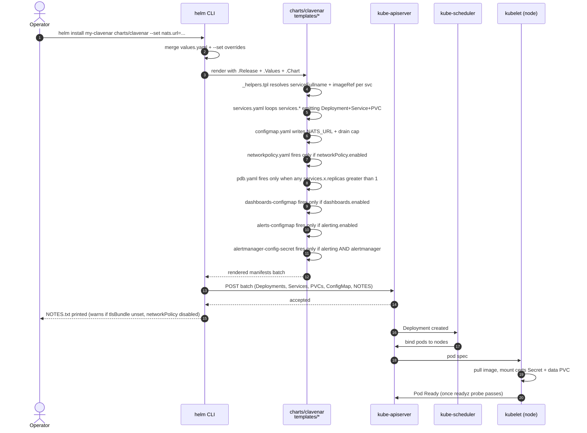
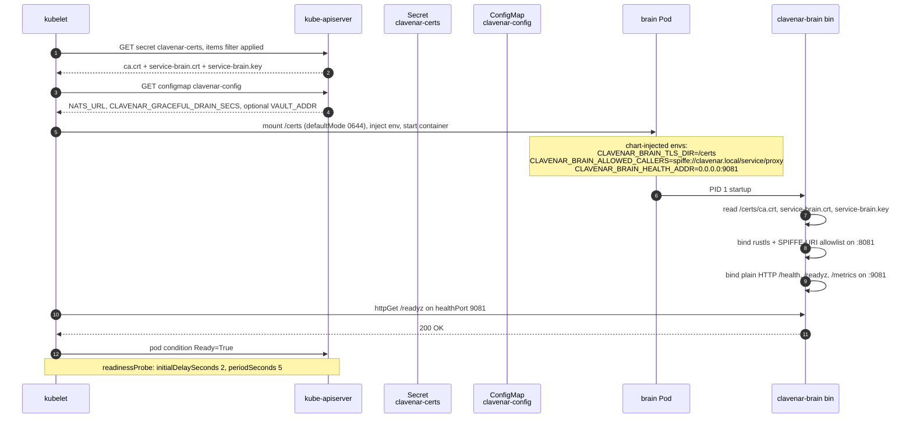
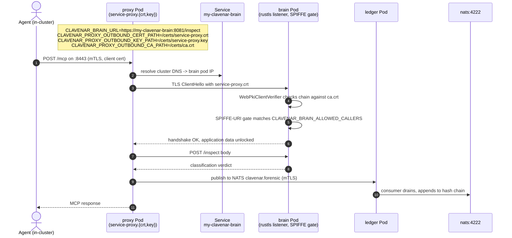
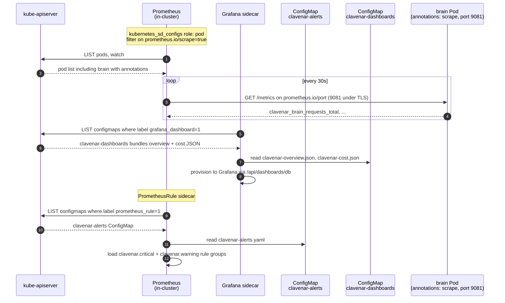
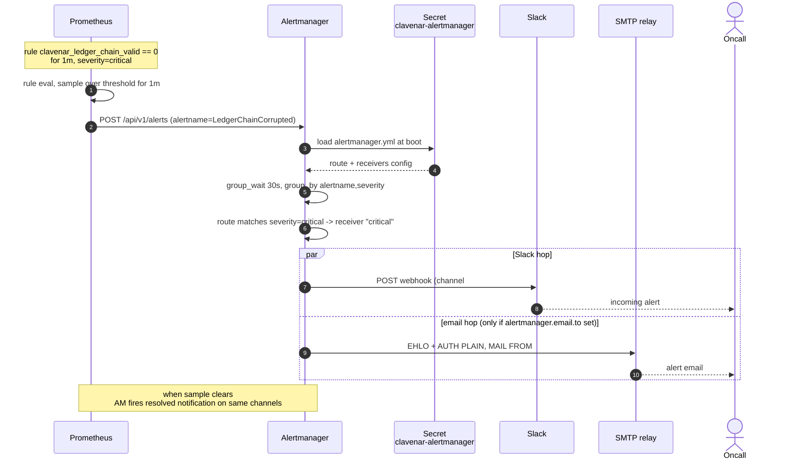
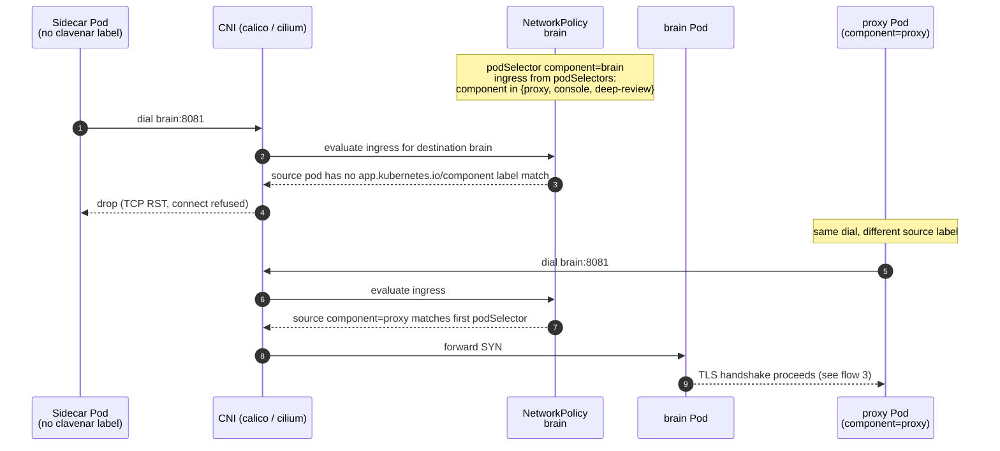
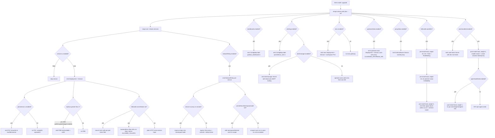

# clavenar-charts — sequence diagrams

Helm chart shape: eight Deployments + Services, optional NetworkPolicy
perimeter, optional PodDisruptionBudgets, optional TLS bundle Secret,
opt-in dashboards + alerts ConfigMaps, opt-in Alertmanager Secret. The
templates live under `charts/clavenar/templates/`; the values surface is
in `charts/clavenar/values.yaml`. Seven flows below cover render + apply,
pod boot, cross-service URL wiring, observability discovery, alert
fan-out, the NetworkPolicy ingress check, and the TLS auto-mint + Vault
hook lifecycle — plus a flowchart of the value-driven render-time
branches.

## 1. `helm install <release> charts/clavenar`

Render is client-side (Helm 3) — the operator's kubectl context posts
the rendered batch straight to the apiserver; no Tiller. The eight
services + their PVCs are created in one apply round; kubelet reconciles
the schedule once the rendered Deployments land.



## 2. Pod boot under `tlsBundle.secretName` set

Each pod mounts only `ca.crt` + its own `service-<name>.{crt,key}` — the
per-pod `items:` projection on the `certs` Secret volume in
`services.yaml` scopes the projection so a compromised pod can't read
another service's private key. Proxy also
mounts `server.{crt,key}` + `client.{crt,key}`. Under TLS mode brain /
policy / hil / identity / ledger move `/health` + `/readyz` + `/metrics`
to a plain-HTTP `healthPort` so kubelet probes and Prometheus scrapes
land without a client cert.



## 3. Cross-service backend URL wiring under `tlsBundle.secretName` set

`_helpers.tpl::clavenar.backendEnvs` flips every cross-service URL to
`https://` and injects `service-<caller>.{crt,key}` mount paths when
`tlsBundle.secretName` is non-empty. Proxy → brain is the canonical
hop; the same shape covers proxy → policy / hil / identity and console
→ ledger / hil / policy / identity.



## 4. Prometheus scrape + Grafana dashboard discovery

`clavenar.metricsAnnotations` writes `prometheus.io/scrape="true"` at the
pod level with a port fallback chain `metrics.port → healthPort → port`,
so under TLS the scrape lands on the plain-HTTP health listener. Rules
+ dashboards ship as ConfigMaps labelled `prometheus_rule:"1"` /
`grafana_dashboard:"1"` for the kube-prometheus-stack sidecar to pick up.



## 5. Alert fan-out — `LedgerChainCorrupted` fires

Severity-based routing splits critical vs. warning. `clavenar.critical`
matches against the `critical` receiver (Slack #clavenar-ops + email when
SMTP is configured); the default `slack-ops` receiver catches the rest.
The Secret form keeps webhook + SMTP creds off ConfigMaps.



## 6. NetworkPolicy perimeter — sidecar tries to reach `brain`

Front-door services (`proxy`, `console`) get `ingress: [{}]` so any pod
in the namespace can hit them; backends restrict to the three legitimate
in-stack callers. The Prometheus exception kicks in only when
`prometheusNamespaceLabel` is set — without that label the scrape lives
in the same namespace as clavenar and matches via the catch-all from
caller pods.



## 7. Install-time hooks — TLS auto-mint then Vault bootstrap

The prerequisite for flows 2 and 3. Under `tlsBundle.autoMint` the chart
mints the `clavenar-certs` bundle from a `pre-install,pre-upgrade` hook
Job before any workload pod schedules; under `vault.bundled.enabled` two
`post-install,post-upgrade` hook Jobs provision the transit key + lab
agent credential after the release lands. Hook weights order the
pre-install set — RBAC `-20` (`tls-automint-rbac.yaml`) → script
ConfigMap `-15` (`tls-automint-script.yaml`) → Job `0`
(`tls-automint-job.yaml`) — so the ServiceAccount and `mint.sh`/`apply.sh`
mount source both exist before the Job starts. The Job splits an
`openssl` initContainer (`mint`, image `alpine/openssl`) from a `kubectl`
main container (`apply`, image `alpine/k8s`) over a shared `/work`
emptyDir; `apply.sh` is a no-op when the target Secret already carries
`ca.crt` under the expected `san-scheme` label and re-mints on scheme
drift, which keeps the CA stable across upgrades. The Vault Jobs run
post-install at weights `0` (`vault-bootstrap-job.yaml`) then `1`
(`vault-seed-job.yaml`).

```mermaid
sequenceDiagram
    autonumber
    actor Op as Operator
    participant Helm as helm CLI
    participant API as kube-apiserver
    participant Mint as Job initContainer<br/>mint (alpine/openssl)
    participant Apply as Job container<br/>apply (alpine/k8s)
    participant Sec as Secret<br/>clavenar-certs
    participant Vault as bundled Vault<br/>(dev-mode, unsealed)
    participant VBoot as Job<br/>vault-bootstrap
    participant VSeed as Job<br/>vault-agent-seed

    Op->>Helm: helm install/upgrade<br/>tlsBundle.autoMint=true, vault.bundled.enabled=true

    Note over Helm,API: pre-install / pre-upgrade hooks, by weight
    Helm->>API: apply SA + Role + RoleBinding (weight -20)
    Helm->>API: apply tls-automint script ConfigMap (weight -15)
    Helm->>API: create tls-automint Job (weight 0)

    API->>Mint: start initContainer mint
    Mint->>Mint: openssl mints CA root + server + client + per-service certs into /work
    Mint-->>API: initContainer exits 0
    API->>Apply: start main container apply
    Apply->>Sec: GET secret clavenar-certs (jsonpath .data.ca.crt)
    alt ca.crt present AND san-scheme == release-prefixed-v2
        Sec-->>Apply: existing bundle, scheme matches
        Apply->>Apply: skip apply — CA stays stable across upgrade
    else absent OR scheme drift
        Apply->>Sec: kubectl create --dry-run then apply -f - (create-or-replace)
        Apply->>Sec: label san-scheme=release-prefixed-v2
    end
    Apply-->>API: Job succeeded, hook-delete-policy reaps SA/Role/ConfigMap/Job

    Note over Helm,API: main release — Deployments, Services, configmap,<br/>vault-token Secret, bundled Vault subchart
    Helm->>API: POST release manifests
    API->>Vault: bundled Vault StatefulSet schedules

    Note over Helm,VSeed: post-install / post-upgrade hooks, by weight
    Helm->>API: create vault-bootstrap Job (weight 0)
    API->>VBoot: start
    VBoot->>Vault: poll vault status until reachable (up to 60x, sleep 2)
    VBoot->>Vault: secrets enable transit (tolerate exists); write transit/keys/clavenar-identity
    VBoot->>Vault: read transit/keys/clavenar-identity (post-condition)
    VBoot-->>API: Job succeeded

    Helm->>API: create vault-agent-seed Job (weight 1)
    API->>VSeed: start
    VSeed->>Vault: poll vault status until reachable
    VSeed->>Vault: kv put secret/agents/agent-001 api_key=stub-key
    VSeed->>Vault: kv get secret/agents/agent-001 (post-condition)
    VSeed-->>API: Job succeeded
    Helm-->>Op: release deployed — pods mount clavenar-certs (flow 2);<br/>identity signs SVIDs via transit
```

## Chart render decision tree

Every value-driven branch in the chart in one tree. The leaves are the
objects that actually land on the apiserver; the gates above them are
the values keys that decide whether they land.


