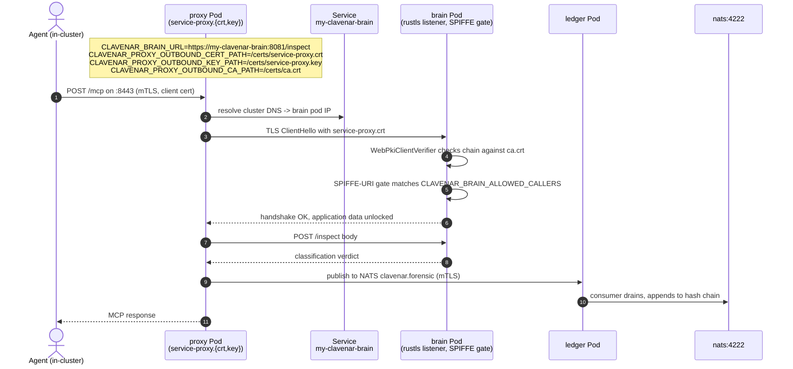
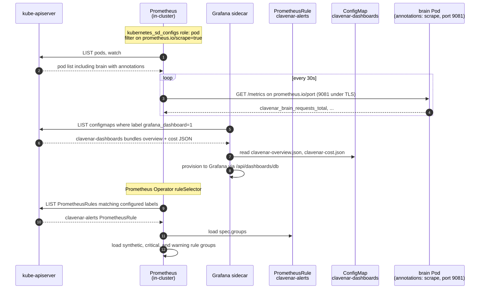
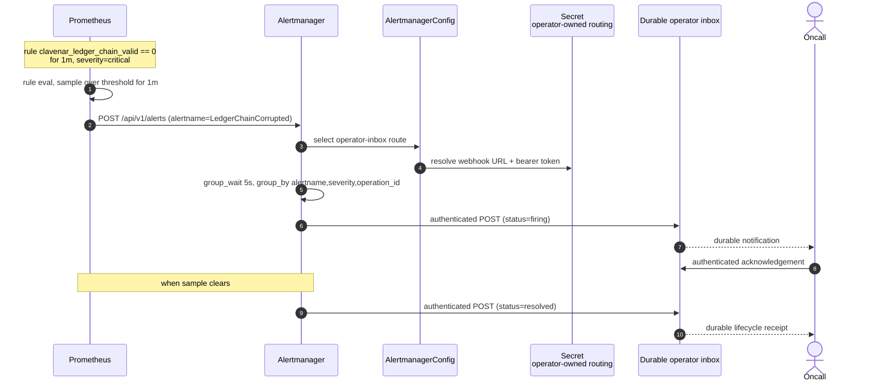
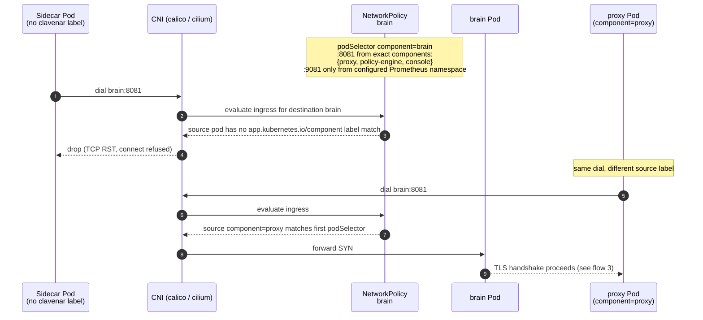

# clavenar-charts — sequence diagrams

Helm chart shape: nine Deployments + Services, optional NetworkPolicy
perimeter, optional PodDisruptionBudgets, optional TLS bundle Secret,
opt-in dashboards + alerts ConfigMaps, opt-in Alertmanager Secret. The
templates live under `charts/clavenar/templates/`; the values surface is
in `charts/clavenar/values.yaml`. Seven flows below cover render + apply,
pod boot, cross-service URL wiring, observability discovery, alert
fan-out, the NetworkPolicy ingress check, and the TLS auto-mint + Vault
hook lifecycle — plus a flowchart of the value-driven render-time
branches.

## 1. `helm install <release> charts/clavenar`

Render is client-side (Helm 3) — the operator's kubectl context posts
the rendered batch straight to the apiserver; no Tiller. The nine
services + their PVCs are created in one apply round; kubelet reconciles
the schedule once the rendered Deployments land.

Before any object is emitted, `deploymentProfile=production` validates the
whole security posture as one unit: an operator-managed HIL authentication
Secret, enabled NetworkPolicy, existing workload TLS with auto-mint off,
console operator mTLS with separate public trust, and the exact website
trusted-proxy identity plus one positive selector on ledger mTLS.


## 2. Pod boot under `tlsBundle.secretName` set

Each pod mounts only `ca.crt` + its own `service-<name>.{crt,key}` — the
per-pod `items:` projection on the `certs` Secret volume in
`services.yaml` scopes the projection so a compromised pod can't read
another service's private key. Proxy also mounts `server.{crt,key}` +
`client.{crt,key}`. Assurance mounts the generic client pair only for its
synthetic proxy/NATS traffic; `service-assurance.{crt,key}` terminates the
exact-console control listener. Under TLS mode brain /
policy / hil / identity / ledger move `/health` + `/readyz` + `/metrics`
to a plain-HTTP `healthPort` so kubelet probes and Prometheus scrapes
land without a client cert. Exact dependency init gates reach the same
ClusterIP-only ports through reviewed NetworkPolicy edges. Assurance similarly moves only `/health` and
`/readyz` to plain diagnostics `9088`; status and mutations remain on mTLS
`8088`.

```mermaid
sequenceDiagram
    autonumber
    participant Kube as kubelet
    participant API as kube-apiserver
    participant Sec as Secret<br/>clavenar-certs
    participant CM as ConfigMap<br/>clavenar-config
    participant Init as workload-tls-projector
    participant Pod as brain Pod
    participant Brain as clavenar-brain bin

    Kube->>API: GET secret clavenar-certs, items filter applied
    API-->>Kube: ca.crt + service-brain.crt + service-brain.key
    Kube->>API: GET configmap clavenar-config
    API-->>Kube: NATS_URL, CLAVENAR_GRACEFUL_DRAIN_SECS, optional VAULT_ADDR
    Kube->>Init: mount exact Secret items mode 0440
    Init->>Pod: copy to memory volume; key mode 0600, cert mode 0444
    Kube->>Pod: mount owner-bound /certs read-only, inject env, start container

    Note over Pod: chart-injected envs:<br/>CLAVENAR_BRAIN_TLS_DIR=/certs<br/>CLAVENAR_BRAIN_ALLOWED_CALLERS=proxy-only inspect prefix<br/>EXPLAIN_CALLER=exact policy-engine<br/>NARRATE_CALLER=exact console<br/>strict body/rate/spend/timeout controls<br/>CLAVENAR_BRAIN_HEALTH_ADDR=0.0.0.0:9081

    Pod->>Brain: PID 1 startup
    Brain->>Brain: read /certs/ca.crt, service-brain.crt, service-brain.key
    Brain->>Brain: bind rustls + route-aware SPIFFE authorization on :8081
    Brain->>Brain: bind plain HTTP /, /health, /readyz, /metrics on :9081
    Note over Brain: no explain, narrate, model, or provider operation on :9081

    Kube->>Brain: httpGet /readyz on healthPort 9081
    Brain-->>Kube: 200 OK
    Kube->>API: pod condition Ready=True
    Note over Kube,API: readinessProbe: initialDelaySeconds 2, periodSeconds 5
```

## 3. Cross-service backend URL wiring under `tlsBundle.secretName` set

`_helpers.tpl::clavenar.backendEnvs` flips cross-service URLs to
`https://` and injects `service-<caller>.{crt,key}` mount paths when
`tlsBundle.secretName` is non-empty. Proxy → brain is the canonical
hop; the same shape covers proxy → policy / hil / identity and console
→ brain / ledger / hil / policy / identity / assurance. Policy-engine's
explanation URL and console's narration/model URL are always the Brain HTTPS
application listener; they never fall back to diagnostics. Brain accepts the
exact policy-engine identity for explain and exact console identity for
narrate/model after the client certificate verifies. The assurance hop likewise
accepts only the exact console SPIFFE URI.



## 4. Prometheus scrape + Grafana dashboard discovery

`clavenar.metricsAnnotations` writes `prometheus.io/scrape="true"` at the
pod level with a port fallback chain `metrics.port → healthPort → port`,
so under TLS the scrape lands on the plain-HTTP health listener. Rules ship as
a standard Prometheus Operator `PrometheusRule`; dashboards remain ConfigMaps
labelled `grafana_dashboard:"1"` for the Grafana sidecar.



## 5. Alert fan-out — `LedgerChainCorrupted` fires

The chart emits a standard `AlertmanagerConfig` that routes every Clavenar
alert to an operator-owned durable inbox. The webhook URL and bearer token are
referenced from an existing Secret; neither credential is accepted inline.



## 6. NetworkPolicy perimeter — sidecar tries to reach `brain`

The proxy agent listener is the only core rule admitting arbitrary sources.
Console ingress is default-deny until an operator supplies an exact peer for
its operator or demo trust class. Backends restrict each destination port to
the named in-stack callers. Brain `:8081` admits only proxy, policy-engine, and
console pods; `:9081` admits no application pod. The Prometheus exception is
added only when `prometheusNamespaceLabel` names its namespace.

In the production profile, the separately deployed website selector gets one
additional path to ledger `:8183` only. Ledger authenticates the exact
`spiffe://clavenar.local/service/website` certificate before honoring a
forwarded client address. Its canonical pod label and explicit namespace are
required to differ from in-release and Prometheus selectors. The selector is
absent from public ledger `:8083`, so direct callers remain keyed by their
socket address.



## 7. Install-time hooks — TLS auto-mint then Vault bootstrap

The prerequisite for flows 2 and 3. Under `tlsBundle.autoMint` the chart
mints the `clavenar-certs` bundle from a `pre-install,pre-upgrade` hook
Job before any workload pod schedules; under `vault.bundled.enabled` two
`post-install,post-upgrade` hook Jobs provision the transit key + lab
agent credential after the release lands. Hook weights order the
pre-install set — RBAC `-20` (`tls-automint-rbac.yaml`) → script
ConfigMap `-15` (`tls-automint-script.yaml`) → Job `0`
(`tls-automint-job.yaml`) — so the ServiceAccount and all three governed
scripts exist before the Job starts. A kubectl `snapshot` initContainer reads
the exact qualified layout label and complete existing Secret, an openssl
`mint` initContainer validates or stages a fresh candidate, and the kubectl
`apply` container performs the transaction. The `/state` and `/work`
emptyDirs are memory-backed. Ordinary `reconcile` upgrades preserve valid
Secret bytes exactly; missing, foreign, partial, mismatched, or implicit trust
changes fail closed. Default membership covers the nine chart-managed
services plus website, demo-mint, and simulator peer identities; the product
pods still project only their own keys. An explicit `rotate` advances a
generation through
old-leaf/dual-root, new-leaf/dual-root, and new-only phases, waiting for every
TLS consumer to become Ready at each boundary. Failure restores the prior
generation, while success retains only the old public CA in a history Secret.
The Vault Jobs run
post-install at weights `0` (`vault-bootstrap-job.yaml`) then `1`
(`vault-seed-job.yaml`).

```mermaid
sequenceDiagram
    autonumber
    actor Op as Operator
    participant Helm as helm CLI
    participant API as kube-apiserver
    participant Snap as Job initContainer<br/>snapshot (alpine/k8s)
    participant Mint as Job initContainer<br/>mint (alpine/openssl)
    participant Apply as Job container<br/>apply (alpine/k8s)
    participant Sec as Secret<br/>clavenar-certs
    participant Vault as bundled Vault<br/>(dev-mode, unsealed)
    participant VBoot as Job<br/>vault-bootstrap
    participant VSeed as Job<br/>vault-agent-seed

    Op->>Helm: helm install/upgrade<br/>tlsBundle.autoMint=true, vault.bundled.enabled=true

    Note over Helm,API: pre-install / pre-upgrade hooks, by weight
    Helm->>API: apply SA + Role + RoleBinding (weight -20)
    Helm->>API: apply tls-automint script ConfigMap (weight -15)
    Helm->>API: create tls-automint Job (weight 0)

    API->>Snap: GET Secret JSON; validate exact label + key inventory
    Snap->>Sec: snapshot existing bytes + stable metadata into memory
    API->>Mint: start initContainer mint
    Mint->>Mint: validate existing bundle and requested policy
    opt operation=rotate with advanced generation
        Mint->>Mint: mint and validate wholly fresh CA + leaves
    end
    Mint-->>API: initContainer exits 0
    API->>Apply: start main container apply
    alt operation=reconcile and canonical Secret present
        Apply->>Apply: no API write — Secret bytes remain exact
    else operation=rotate
        Apply->>Sec: old leaves + old/new public roots
        Apply->>API: roll TLS consumers; wait Ready within deadline
        Apply->>Sec: new leaves + old/new public roots
        Apply->>API: roll TLS consumers; wait Ready within deadline
        Apply->>Sec: new leaves + new public root only
        Apply->>API: roll TLS consumers; wait Ready
        Apply->>Sec: archive retired public ca.crt only
    end
    Apply-->>API: Job succeeded, hook-delete-policy reaps SA/Role/ConfigMap/Job

    Note over Helm,API: main release — Deployments, Services, configmap,<br/>vault-token Secret, bundled Vault subchart
    Helm->>API: POST release manifests
    API->>Vault: bundled Vault StatefulSet schedules

    Note over Helm,VSeed: post-install / post-upgrade hooks, by weight
    Helm->>API: create vault-bootstrap Job (weight 0)
    API->>VBoot: start
    VBoot->>Vault: poll vault status until reachable (up to 60x, sleep 2)
    VBoot->>Vault: secrets enable transit (tolerate exists); write transit/keys/clavenar-identity
    VBoot->>Vault: read transit/keys/clavenar-identity (post-condition)
    VBoot-->>API: Job succeeded

    Helm->>API: create vault-agent-seed Job (weight 1)
    API->>VSeed: start
    VSeed->>Vault: poll vault status until reachable
    VSeed->>Vault: kv put secret/agents/_legacy_unqualified/agent-001 api_key=stub-key
    VSeed->>Vault: kv get secret/agents/_legacy_unqualified/agent-001 (post-condition)
    VSeed-->>API: Job succeeded
    Helm-->>Op: release deployed — pods mount clavenar-certs (flow 2);<br/>identity signs SVIDs via transit
```

## Chart render decision tree

Every value-driven branch in the chart in one tree. The leaves are the
objects that actually land on the apiserver; the gates above them are
the values keys that decide whether they land.

```mermaid
flowchart TD
    H[helm install / upgrade] --> V[merge values.yaml plus --set]
    V --> Prof{deploymentProfile?}
    Prof -->|evaluation| Loop[range over .Values.services]
    Prof -->|production and all prerequisites valid| Loop
    Prof -->|production missing auth TLS policy trust or website peer| Refuse[fail render before apply]

    Loop --> En{services.x.enabled?}
    En -->|false| Skip[skip service]
    En -->|true| Dep[emit Deployment + Service]

    Dep --> Pers{persistence.x.enabled?}
    Pers -->|yes| Pvc[emit PVC mounted at /var/lib/clavenar]
    Pers -->|no| NoPvc[no PVC, emptyDir-equivalent]

    Dep --> Repl{replicas greater than 1?}
    Repl -->|yes AND podDisruptionBudget.enabled| Pdb[emit PDB minAvailable = ceil/2]
    Repl -->|no| NoPdb[no PDB]

    Dep --> Tls{tlsBundle.secretName set?}
    Tls -->|yes| Mount[mount /certs with per-pod items filter]
    Tls -->|yes| Envs[backendEnvs flips URLs to https, injects route callers]
    Tls -->|no| Plain[legacy hops use HTTP; Brain auxiliary clients remain HTTPS and fail soft]

    Loop --> Np{networkPolicy.enabled?}
    Np -->|yes| NpEmit[emit NetworkPolicy per service]
    NpEmit --> NpFront{service is proxy?}
    NpFront -->|yes| Open[agent mTLS ingress allows arbitrary sources]
    NpFront -->|no| Restrict[exact listener-specific callers; console default-deny]
    NpEmit --> Web{production website peer configured?}
    Web -->|yes| LedgerTls[admit exact selector to ledger 8183 only]
    NpEmit --> Scrape{prometheusNamespaceLabel set?}
    Scrape -->|yes| AddScrape[add namespaceSelector rule for scraper]
    Scrape -->|no| NoScrape[scraper must run in same ns or be excluded]

    V --> Dash{dashboards.enabled?}
    Dash -->|yes| DashCm[emit ConfigMap label grafana_dashboard=1]
    V --> Alerts{alerting.enabled?}
    Alerts -->|yes| AlertsRule[emit PrometheusRule with discovery labels]
    Alerts --> Am{alertmanager.enabled?}
    Am -->|yes| AmConfig[emit AlertmanagerConfig with Secret references]
    Am -->|no| NoAm[operator wires alerts into their own Alertmanager]

    V --> Exec{exec.enabled?}
    Exec -->|yes| ExecDep[emit evaluation-only exec mTLS Deployment + Service + workspace PVC + Proxy-only NetworkPolicy]
    ExecDep --> ExecTrust[project only CA + service-exec cert/key; Proxy uses exact workload-mTLS client]
    ExecDep --> ExecHealth[plain health-only 9002; no MCP fallback]
    Exec -->|no| NoExec[no exec gateway]

    V --> Stub{upstreamStub.enabled?}
    Stub -->|yes| StubDep[emit upstream-stub Deployment + Service, auto-wire proxy CLAVENAR_UPSTREAM_URL]

    V --> Alias{proxyAlias.enabled?}
    Alias -->|yes| AliasSvc[emit ExternalName Service named proxy]

    V --> Auto{tlsBundle.autoMint?}
    Auto -->|yes| AutoRbac[pre-install hook, weight -20, SA + Role + RoleBinding]
    AutoRbac --> AutoCm[pre-install hook, weight -15, tls-automint script ConfigMap]
    AutoCm --> AutoJob[pre-install hook, weight 0, mint then apply Secret unless ca.crt + scheme match]

    V --> Vault{vault.bundled.enabled?}
    Vault -->|yes| VaultTok[emit vault-token Secret with dev root token]
    Vault -->|yes| VaultBoot[post-install hook, weight 0, enable transit + create clavenar-identity key]
    VaultBoot --> Seed{agentVaultSeed.enabled?}
    Seed -->|yes| SeedJob[post-install hook, weight 1, kv put secret/agents/_legacy_unqualified/agent-001]
    Seed -->|no| NoSeed[BYO per-agent creds]
```


